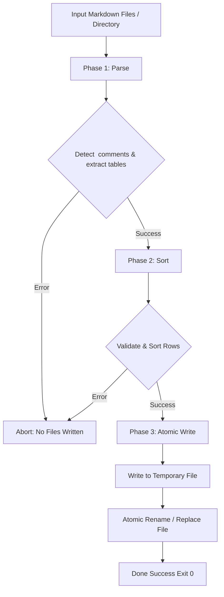

# Architecture & Contributor Guide

Welcome to the contributor guide for `Sort Markdown Tables` (`smt`). This document details the technical design, module structure, and execution pipeline.

---

## 1. Two-Phase Atomic Pipeline

`smt` guarantees **zero file corruption**. If parsing or sorting fails on any file, no files on disk are touched.



### Pipeline Guarantees

- **Phase 1 (Parse)**: Scans documents, extracts markdown table structures, parses HTML comment attributes (`type`, `column`, `order`, `case`).
- **Phase 2 (Sort)**: Applies deterministic stable sorting algorithms (`sort_by`).
- **Phase 3 (Write)**: Uses `tempfile` to write out results atomically before replacing original files on disk.

---

## 2. Module Layout

```
src/
├── main.rs      # CLI entry point; orchestrates parse -> sort -> write pipeline
├── cli.rs       # Clap argument parsing, validation, and glob expansion
├── parser.rs    # Hand-rolled markdown table & HTML comment parser
├── sorter.rs    # Sorting algorithms (numeric f64, lexicographic, case, order)
├── writer.rs    # Atomic tempfile writer and stdout formatting
└── error.rs     # Centralized SmtError error types via thiserror
```

---

## 3. Algorithm & Design Decisions

### Stable Sort Guarantee

All sorting operations use Rust's `sort_by()` algorithm (never `sort_unstable_by()`). Equal key values preserve their original relative order in the document.

### Numeric Comparison

Numeric mode parses table cell content into 64-bit floating point numbers (`f64`).

- Handles integer and decimal values.
- Safely handles `NaN` and `Infinity` without panicking.
- Non-numeric strings fall back safely to lexicographic sorting.

### Zero-Regex Parsing

Comment parsing is hand-rolled using Rust standard library string operations (`str::split`, `str::find`). This eliminates regular expression overhead and security vulnerabilities like ReDoS.

---

## 4. Dependencies

| Crate       | Version | Purpose                                 |
| :---------- | :-----: | :-------------------------------------- |
| `clap`      |  `4.x`  | CLI argument parsing with derive macros |
| `thiserror` |  `2.x`  | Strongly typed error definitions        |
| `anyhow`    |  `1.x`  | Idiomatic error propagation             |
| `glob`      | `0.3.x` | File pattern glob expansion (`**/*.md`) |
| `tempfile`  |  `3.x`  | Safe atomic file replacements           |

---

## 5. Local Development & Testing

### Building from Source

```bash
cargo build --release
```

### Running Test Suite

```bash
cargo test
```

### Formatting Code

Format all files (Rust, Nix, Markdown, TOML) using treefmt / Nix:

```bash
nix fmt
```
